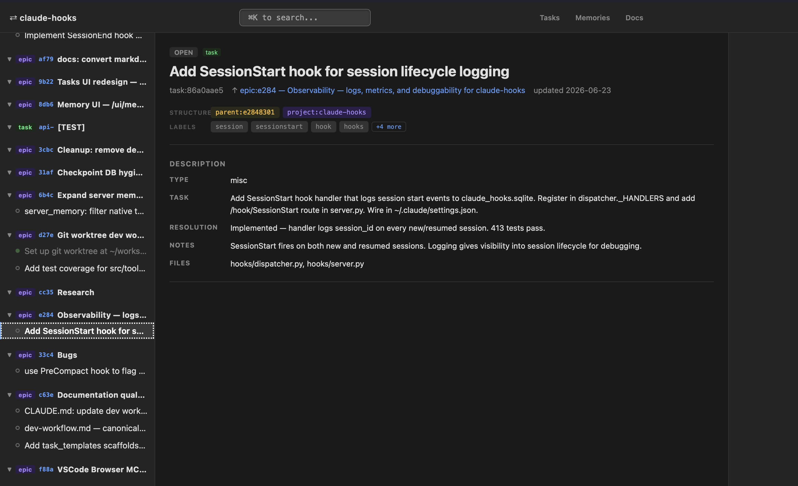

# Lite Task Framework - For the SOLO Developer

A lightweight task framework for Claude Code — persistent task tracking, memory injection, and structured decision logging via Claude hooks.

---
http://localhost:8766/ui/tasks/

## The perspective

Jira was the right idea. But it was always human-operated and AI-opaque. Now agents can close that gap natively.

Jira was the original development graph. It worked for teams. Epics, tasks, subtasks — every piece of work traced to a reason.

But Jira content is human-readable, not agent-readable. It breaks the moment an AI tries to operate on it without the right tooling around it.

Jira does expose MCP tools now. The graph can technically be agent-operated. But it's heavyweight — the infrastructure, the licensing, the setup — built for organisations, not for a solo developer running an AI-assisted workflow.

The real unlock is agents that create the full epic graph from a requirement, evaluate each item, and execute — with task:<id> in every commit, tying every change to a coherent piece of work. Nothing unattributed. Nothing untraceable.

That's not a workaround for bad process. It's the natural evolution of what Jira was always trying to do — lightweight, native, and built around how AI-assisted development actually works.


---

## New here?

```text
/onboarding
```

Run this in Claude Code after cloning the repo. It detects your OS, checks prerequisites, walks you through hooks and MCP server registration with your real paths filled in, and verifies the setup — one step at a time.

---

## What it looks like in practice

### Starting a task

```
migrate the auth module to use the new token schema  /task-framework
```

`/task-framework` assesses complexity and proposes a split:

```
This touches 3 areas — proposing subtasks:
  1. Audit current token usage across auth module
  2. Replace legacy token calls with new schema
  3. Update tests and integration points

Create as subtasks under a parent epic?
```

You confirm. `/task-create` fires internally — creates the epic, three subtasks with `parent_id` links, and activates the first one:

```
task:4a2c done  →  Audit current token usage
task:7f1e active  →  Replace legacy token calls with new schema

Tracking turns and tools. Say "task:7f1e done" when finished.
```

---

### Logging a decision mid-task

A load-bearing choice comes up during implementation:

```
use opaque tokens stored in Redis rather than stateless JWTs  /task-task-log-decision
```

```
Decision logged to task:7f1e: "Chose opaque tokens over JWT — avoids key rotation
complexity on short-lived sessions; Redis eviction handles expiry"
```

This survives context compression and appears under `## Task decisions` in every subsequent turn for that task — Claude never asks why again.

---

### Working through prompts

```
> implement the token replacement in auth/session.py
> run the tests to confirm nothing broke
> also update the middleware to pass the new token header
```

Each turn is tracked. Claude commits after the subtask is complete:

```
/gc
```

```
✓ Committed: "refactor(auth): replace legacy token calls with opaque token schema

task:7f1e"
```

---

### Pausing gracefully mid-session

Something comes up and you want Claude to stop cleanly:

```
/pause
```

```
Paused. Completed: middleware updated, tests passing.

Pending (saved to task:7f1e):
- Update the logout endpoint to revoke Redis tokens
- Add token TTL config to settings.py

Waiting for your input.
```

Claude saves the pending work to the task body and stops — no half-finished reasoning, no context dropped.

---

### Resuming next session

```
continue task:7f1e
```

Claude reads the full turn history and the `## Pending before paused` section — picks up at the logout endpoint without re-explaining anything.

```
Resuming task:7f1e — Replace legacy token calls with new schema

Pending from last session:
- Update logout endpoint to revoke Redis tokens
- Add token TTL config to settings.py

Starting with logout endpoint...
```

---

### Closing out

All subtasks done. Parent auto-closes when the last subtask is marked done:

```
task:7f1e done
```

```
task:7f1e closed — Replace legacy token calls
task:9b3d closed — Update tests and integration points
epic:4a1b closed — Migrate auth module to new token schema  ✓

Push when ready: git push
```

Three sessions, three subtasks, one audit trail, zero recap.

---

## Skills

| Skill | What it does |
|-------|--------------|
| `/onboarding` | Interactive setup guide — clone, prereqs, hooks, MCP server, smoke test |
| `/task-framework` | Start a tracked task — creates subtasks, activates the first, begins logging |
| `/task-create` | Create Jira-style issues — epic / story / task / bug / subtask with hierarchy rules |
| `/gc` | Commit with automatic task tagging and pre-commit test run |
| `/task-log-decision` | Persist a key design decision to the active task so it survives future sessions |
| `/pause` | Finish the current action, save pending intent to the active task, and wait for user input |
| `/deploy` | Deploy dev→test→main — runs unit gate, full suite, then ships to main |
| `/task-introspection` | Post-task retrospective — surface unlogged decisions, stale memories, encode learnings |

---

## Docs

- [Architecture](docs/ARCHITECTURE.md) — how the pipeline is structured and why
- [Setup](docs/setup.md) — installation and configuration
- [Skills](docs/skills.md) — full skill reference
