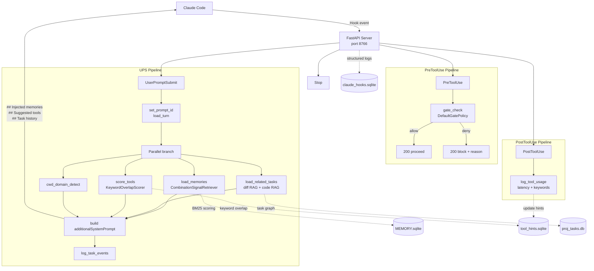

# claude-hooks Architecture

> This document describes the system as built — the decisions made, why they were made, and the constraints that shaped the design.

---

## Overview

`claude-hooks` is a Python system that intercepts all four Claude Code hook events and runs a **LangGraph StateGraph pipeline** in response. Its responsibilities are:

1. **Memory injection** — score and inject relevant memories from `MEMORY.sqlite` into every prompt
2. **Tool hint surfacing** — retrieve relevant MCP tools based on prompt intent and domain
3. **Anti-hallucination gating** — hard-block irreversible MCP tool calls unless a prerequisite tool actually ran this prompt
4. **Tool usage tracking** — accumulate latency and keyword signals per MCP tool for future retrieval
5. **Task tracking** — inject persistent work context (history, code chunks, memories) for the active task

---

## System Diagram

---

## Sections

- [State Architecture](arch/state.md) — FastAPI persistent server, MemorySaver as session bus, SessionState fields
- [Graph & Pipeline](arch/graph_pipeline.md) — Graph topology, UPS pipeline, domain classification, anti-hallucination gate, tool tracking
- [System Prompt](arch/system_prompt.md) — All `additionalSystemPrompt` sections and what populates them
- [Task Framework](arch/task_framework.md) — Task lifecycle, activation flow, context injection, auto-close
- [Mid-Task Decisions](arch/mid_task_decisions.md) — Explicit decision tracking, checkpoint persistence, session restore via /task-task-log-decision
- [Databases, MCP & Observability](arch/databases.md) — Database files, MCP tool hosting, logging architecture
- [Gates](arch/gates.md) — Gate framework, all current gates, how to add a new one
- [MCP / Hooks Boundary](arch/mcp_hooks_boundary.md) — Ownership rule: MCP owns domain DBs, hooks own checkpoint; PostToolUse bridge nodes
- [Design Decisions](arch/design_decisions.md) — Key choices and rationale; what this system is not
- [New Repo Onboarding](new_repo_onboarding.md) — How to register a new project into `cwd_domains.json` and seed memories
- [Setup Guide](setup.md) — Getting claude-hooks running from scratch; database creation, hook registration, env vars
